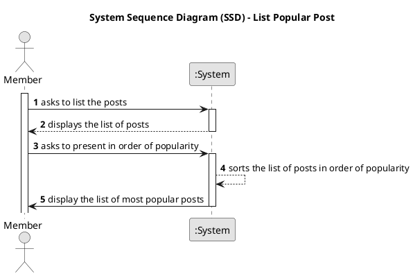

<p align="center">
 
</p>
<h1 align="center">DDDForum.com</h1>

<p align="center">
 <a href="https://circleci.com/gh/stemmlerjs/ddd-forum"></a>
 <a href="#contributors"></a>
</p>

> A [SOLID](https://khalilstemmler.com/articles/solid-principles/solid-typescript/) hackernews-inspired forum site built with TypeScript using the [clean architecture](https://khalilstemmler.com/articles/software-design-architecture/organizing-app-logic/) and [DDD best practices](https://khalilstemmler.com/articles/domain-driven-design-intro/).


# Rodrigo Magalhaes - 1230207
 Este readme explica como funciona o PlantUML e como foi gerado automaticamente os diagramas
### US 001 - List Popular Post
No diretorio:

```bash
/docs/project/us001/02.requirements-engineering/puml/us006-system-sequence-diagram-list-popular-post 
```

Está o diagrama UML que representa o caso de uso US001 - List Popular Post.



Este diagrama descreve a sequência de passos que o utilizador tem de fazer para listar os posts mais populares.

O seu svg após ser gerado pelo script é o seguinte:


## Explicação do generate-plantuml-diagrams.bat
O script generate-plantuml-diagrams.bat é responsável por gerar os diagramas UML no formato .svg a partir dos ficheiros .puml existentes na pasta /docs. O script percorre todos os ficheiros .puml e gera os respetivos .svg na pasta /svg.

```bat
@echo off
setlocal EnableDelayedExpansion

set PLANTUML_PATH=./libs/plantuml-1.2023.1.jar
set INPUT_FOLDER=./docs

for /r "./docs" %%f in (*.puml) do (
    set INPUT_FILE=%%f
    echo Processing file !INPUT_FILE!
    set OUTPUT_FILE=!INPUT_FILE:%INPUT_FOLDER%=!
    set OUTPUT_FILE=!OUTPUT_FILE:.puml=.svg!
    set OUTPUT_FILE=%INPUT_FOLDER%\%OUTPUT_FILE%

    java -jar "%PLANTUML_PATH%" -tsvg "%%f" -o "%OUTPUT_FILE%" ../svg
)

echo Finished
```

### Como gerar os diagramas UML
Para gerar documentação para o projeto tem de se correr a seguinte npm task.

```bash	
npm run generate-plantuml-diagrams
```

### build.gradle
A seguinte tarefa feita no build.gradle executa o script existente em /bin/generate-plantuml-diagrams.bat

```groovy
node {
    version = '12.22.12'
}

task runBatchUMLScript(type: Exec) {
    def scriptPath = file(project.projectDir.toString() + '/bin/generate-plantuml-diagrams.bat')
    commandLine 'cmd', '/c', scriptPath
}
```
1. **node** - Define a versão do node que será utilizada para executar o script
2. **runBatchUMLScript** - Define a tarefa que será executada quando se correr o comando
```bash
 **gradle runBatchUMLScript**
```

Quando a task for executada irá gerar os ficheiros .svg nas respetivas pastas svg em que estão os ficheiros .puml

### package.json
A task escrita no build.gradle é chamada através do package.json através do script:

```bash
"runUMLscript": "gradle runBatchUMLScript"
```
