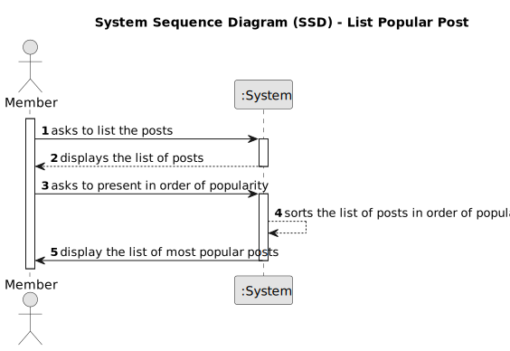

# US 006 - To create a Task 

## 1. Requirements Engineering

### 1.1. User Story Description

As an member, I want to see the most popular posts listed.

### 1.2. Acceptance Criteria

* **AC1:** The list must be ordered by the number of upvotes.

### 1.3. Found out Dependencies

* There is a dependency to "US001 List Popular Post"

### 1.4 Input and Output Data

**Output Data:**

* List of popular posts
* (In)Success of the operation

### 1.5. System Sequence Diagram (SSD)

**Other alternatives might exist.**

#### Alternative One

### 1.6 Other Relevant Remarks

* The created task stays in a "not published" state in order to distinguish from "published" tasks.